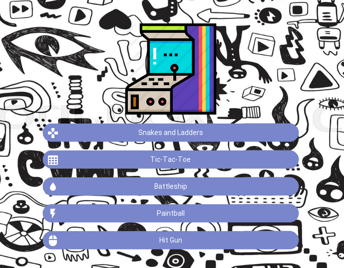
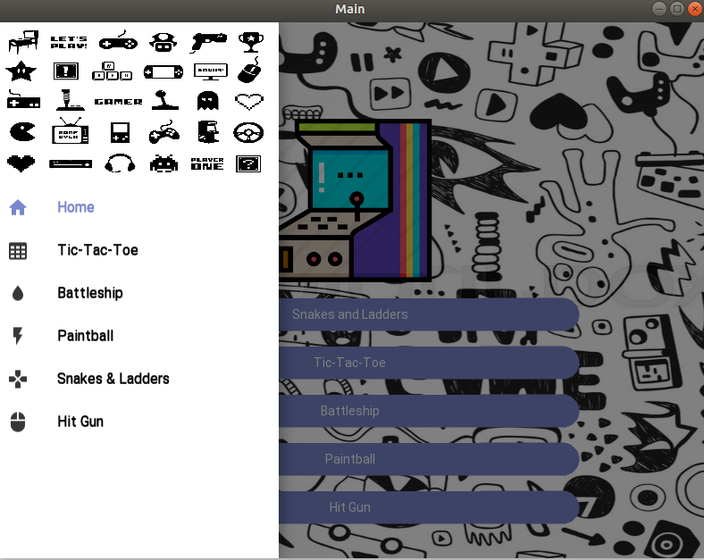
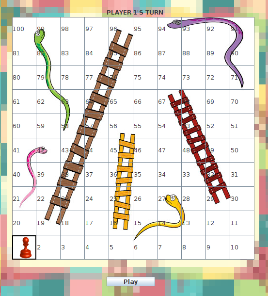
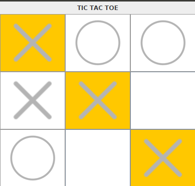
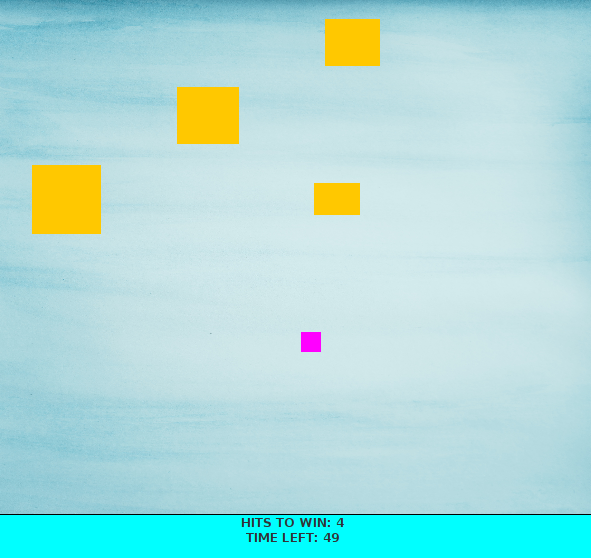

# Arcade of Desktop Games

We have developed some Desktop Games which are easy to understand and can be played by anyone of any age group.
The games are listed as following :

* Snakes and Ladders
* Tic-Tac-Toe
* Battleship
* Paintball
* Hit Gun

You might be familiar with most of these games. Nevertheless, the rules of these games are mentioned in the starting of each game.


Some of the screenshots of our desktop games arcade are added below: 









## Installation

Use the package manager [pip](https://pip.pypa.io/en/stable/) to install all the requirements.

```bash
pip install -r requirements.txt

# pip version 20+
```

## Run Desktop Games

```python
python main.py
```

## Contributors
* [Vaibhav Setia](https://github.com/vaibhav-setia)
* [Aditya Sharma](https://github.com/dadhichaditya)
* [Nikita Gupta](https://github.com/nikitagupta1006)


## License
[MIT](https://choosealicense.com/licenses/mit/)
